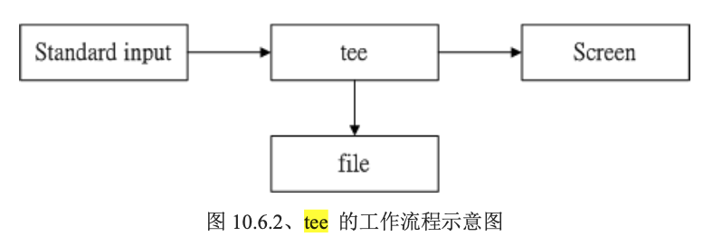

## Bash 基本功能

- 通过 **type** 命令，可以知道每个命令是否为 bash 的内置命令
  ```bash
  >$ type cd
  cd is a shell builtin
  >$ type ll
  ll is aliased to `ls -alF'
  ```
  - **type** 也可以用来作为类似 which 命令的用途
- `\[Enter]` 也就是在一行结束时，以 `\` 结束可以继续在下一行填写命令
- 变量的显示：`echo $variable` 或是 `echo ${variable}`，例如 `echo $PATH`
- 变量的设置规则
  - 变量与变量内容以一个等号 “=” 来连接，例如
    - myname=VBird
  - 变量内容若有空格符可使用双引号或单引号将变量内容结合起来
    - 双引号内的特殊字符可保留原有的特性
    - 单引号内的特殊字符仅为一般字符
  - 可用转义字符 `\` 将特殊符号变成一般字符
  - 在一串命令中，还需要通过其他的命令提供的信息，可以使用反单引号或 “$(命令)”，例如
    ```bash
    >$ version=$(uname -r)
    >$ echo $version
    4.15.0-210-generic
    ```
  - 若该变量为了增加变量内容时，则可用 `"$变量"` 或 `${变量}` 累加内容，例如
    ```bash
    >$ PATH="$PATH":/home/bin
    ```
  - 若该变量需要在其他子进程（在当前 shell 中另打开的 shell）执行，则需要以 export 来使变量变成环境变量
  - 通常大写字符为系统默认变量，自行设置变量可以使用小写字符
  - 取消变量的方法为使用 "unset 变量名称" (仅仅能取消当前 shell 下的变量)
- 环境变量的功能
  - 用 `env` 查看环境变量与常见环境变量说明
  - 用 `set` 查看所有变量 (环境变量+bash相关变量+用户自定义变量)
  - `$` 本身也是一个变量，指代的是目前这个 shell 的线程代号，即 PID
  - `?` 指代的是上一个执行的命令所回传的值（一般来说，命令执行成功回传 0，执行错误，则回传错误代码）
  - `export` 将自定义变量转换成环境变量（子进程仅仅会继承父进程的环境变量）
- 历史命令 `history`
  ```bash
  >$ history 4                    # 列出最近执行的 4 条指令
  >$ history -w                   # 立刻将目前的数据写入 histfile 中（~/.bash_history）
  >$ !!                           # 执行上一个命令
  >$ !n                           # 执行第 n 个命令
  ```

## Bash Shell 的操作环境

- 命令的运行顺序
  1. 以相对/绝对路径执行命令，例如 `/bin/ls` 或 `./ls`
  2. 由 `alias` 找到该命令来执行
  3. 由 bash 内置的（builtin）命令来执行
  4. 通过 $PATH 这个变量的顺序找到的第一个命令来执行
- login 与 non-login shell
  - login shell：取得 bash 时需要完整的登录流程
  - non-login shell：取得 bash 接口不需要重复登录的举动
  - `/etc/profile` 是系统整体的设置，login shell 才会读，每个用户登录取得 bash 时一定会读取的配置文件，可帮所有用户设定整体的环境变量。bash 的 login shell 情况下所读取的整体环境配置文件其实只有 `/etc/profile`
  - `~/.bash_profile` 在 login shell 才会读，它是个人偏好配置文件，login shell 的 bash 中，所读取的顺序（按从上到下的顺序读取，**只会读取其中一个**）
    - `~/.bash_profile`
    - `~/.bash_login`
    - `~/.profile`
  - `~/.bashrc` 在 non-login shell 会读，有的操作系统会调用 `/etc/bashrc`
- 利用 `source` 或是 `.` 都可以将配置文件的内容读进目前的 shell 环境中
- `.bash_logout` 记录了注销 bash 后系统的操作
- 终端机的环境设置
  - 利用 `stty` 帮助设置终端机的输入按键代表意义


## 数据流重定向

- 数据流重定向就是将某个命令执行后应该要出现在屏幕上的数据传输到其他的地方
  
- 标准输入（stdin）：代码为 0，使用 < (覆盖) 或 << (条件终止)
- 标准输入（stdout）：代码为 1，使用 > (覆盖) 或 >> (累加)
- 标准错误输出（stderr）：代码为 2，使用 2> (覆盖) 或 2>> (累加)
- 输出范例：
  ```bash
  # 将 stdout 与 stderr 分别存到不同的文件中去
  >$ find /home -name .bashrc > list_right 2> list_error
  # 将 stderr 丢弃，屏幕上显示正确的数据
  >$ find /home -name .bashrc 2> /dev/null
  # 将命令的数据全部写入名为 list 的文件中
  >$ find /home -name .bashrc > list 2> list  # 错误，可能交叉写入造成次序的错误
  >$ find /home -name .bashrc > list 2>&1     # 正确
  >$ find /home -name .bashrc &> list         # 正确
  ```
- `<` 与 `<<` 表示的是将原本需要由键盘输入的数据改由文件内容来替代，范例
  ```bash
  # 复制 ~/.bashrc 到 catfile
  >$ cat > catfile < ~/.bashrc
  ```

## 管道命令（pipe）

- 管道命令 `|` 仅能处理经由前面一个命令传来的正确信息（stdin），对于错误信息（stderr）并没有直接处理能力
- 每个管道后面接的第一个数据必定是命令，而且这个命令必须要能接收 stdin 的数据才行

### 选取命令：cut，grep

#### cut

- 将一段信息的某一段 “切” 出来，处理的信息是以行为单位
```bash
>$ cut -d '分隔字符' -f fields      # 用于分隔字符
>$ cut -c 字符范围                  # 用于排列整齐的信息
```

#### grep

- 分析一行信息，若当中有我们想要的信息，就将该行拿出
```bash
>$ last | grep root                      # 将 last 当中有出现 root 的那一行取出来
>$ last | grep -v root                   # 将 last 当中没有出现 root 的那一行取出来
>$ last | grep root | cut -d ' ' -f1     # 将 last 当中有出现 root 的那一行取出来，并且仅取第一列
>$ grep 'MANPATH' /etc/manpath.config    # 取出 /etc/manpath.config 内含 MANPATH 的那几行
```

#### 排序命令：sort, wc, uniq

##### sort

- 依据不同的数据类型来排序

```bash
>$ cat /etc/passwd | sort
>$ cat /etc/passwd | sort -t ':' -k 3      # /etc/passwd 内容以 : 来分隔，通过 sort 来对第三列排序
>$ last | cut -d ' ' -f1 | sort            # 利用 last 将输出的数据仅取账号，并加以排序
```

##### uniq

- 将重复的行删除掉只显示一个
- 通常会结合排序指令（sort）来执行（对排序后的数据进行此操作）

```bash
>$ last | cut -d ' ' -f1 | sort | uniq        # 使用 last 将账号列出，仅取出账号列，进行排序后仅取出一位
>$ last | cut -d ' ' -f1 | sort | uniq -c     # 使用 -c 进行计数
```

##### wc

- 计算输出的信息的整体数据

```bash
>$ cat /etc/manpath.config | wc                     # 输出的三列 131 715 5174 分别代表行、字数、字符数
>$ last | grep [a-zA-Z] | grep -v 'wtmp' | wc -l    # 统计登录总人次
```

#### 双向重定向：tee

- `tee` 可以让 standard output (stdout) 转存一份到文件内并将同样的数据继续送到屏幕去处理



```bash
>$ last | tee last.list | cut -d " " -f1        # 将 last 的输出转存一份到 last.list
>$ ls -l /home | tee ~/homefile | more          # 将 ls 的输出转存一份到 ~/homefile
>$ ls -l / | tee -a ~/homefile | more           # tee 后接的文件内容会被覆盖，加上 -a 参数则将信息累加
```

#### 字符转换命令：tr, col, join, paste, expand

##### tr

- 删除一段信息当中的文字，或者是进行文字信息的替换

```bash
>$ last | tr '[a-z]' '[A-Z]'                    # 将 last 输出的信息中所有的小写字符变成大写字符(替换)
>$ cat /etc/passwd | tr -d ':'                  # 将 /etc/passwd 中输出的 : 删除
```

##### col

- col 经常被利用于将 man page 转存为纯文本以方便查阅

```bash
>$ cat /etc/manpath.config | col -x | cat -A | more         # 将 [tab] 转成空白
>$ man col | col -b > /root/col.man                         # -b ：文字内有反斜杠（/）时，仅保留反斜杠最后接的那个字符
```

##### join

- 将两个文件当中有相同数据的那一行加在一起

```bash
>$ join -t ':' /etc/passwd /etc/shadow               # 将两个文件每一行的第一个字段相同者整合成一行
>$ join -t ':' -1 4 /etc/passwd -2 3 /etc/group      # 同上，针对每个文件制定不同的字段进行比较
```

##### paste

- 直接将两行贴在一起，且中间以 `[tab]` （默认）建隔开

```bash
>$ paste /etc/passwd /etc/shadow                                               # 将 /etc/passwd 与 /etc/shadow 同一行粘贴在一起
>$ cat /etc/group | paste /etc/passwd /etc/shadow - |  head -n 3               # 将 /etc/group 与上个例子的结果贴在一起，- 表示 stdin，也就是 cat /etc/group 的结果
```

##### expand

- 将 tab 键转换为空格
- `unexpand` 是其逆操作，也就是将空格转换为 tab

```bash
>$ grep '^MANPATH' /etc/manpath.config | head -n 3 | expand -t 6 - | cat -A   # -t 后接数字，自定义一个 [tab] 按键代表多少个字符（默认是 8）
```

#### 切割命令：split

- 可以将一个大文件依据文件大小或行数来切割成为小文件

```bash
>$ split -b 300k /etc/termcap termcap         # 将 /etc/termcap 以 300KB 为大小进行拆分
>$ cat termpcap* >> termcapback               # 将上一个例子输出的文件合成一个大文件
>$ ls -al / | split -l 10 - lsroot            # 将 ls -al / 输出的信息，每 10 行记录成一个文件
```


